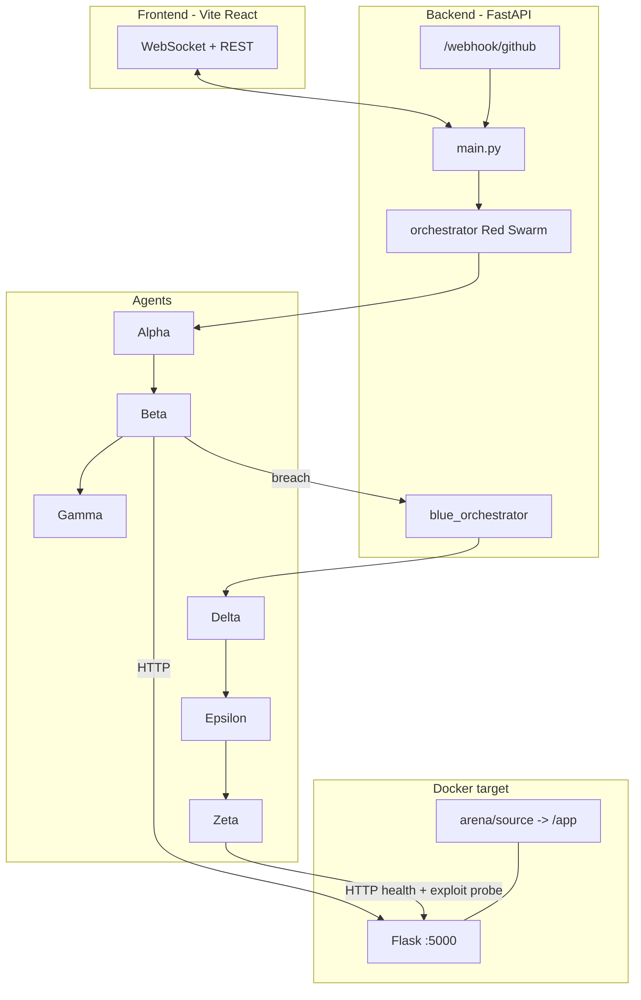
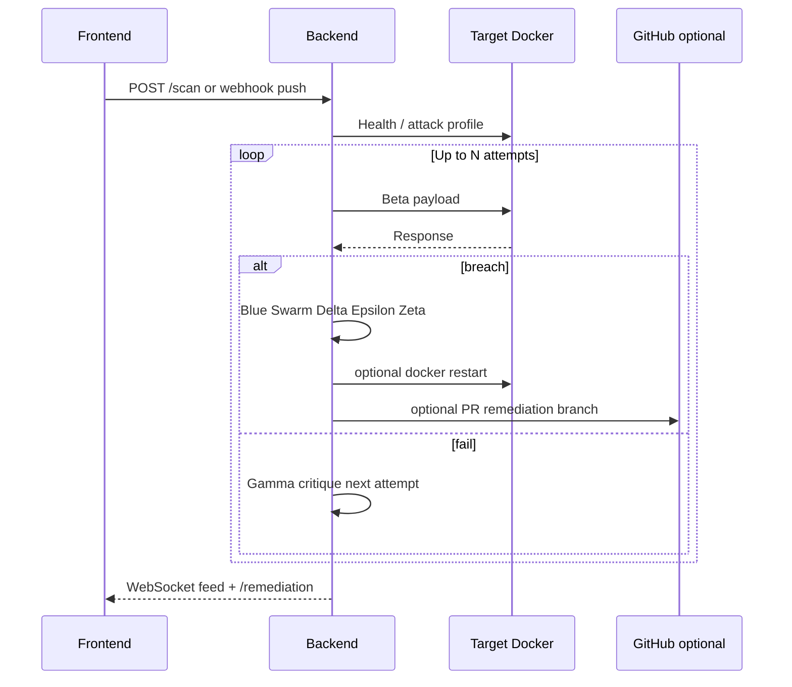

# Project Zero-Day

**Autonomous red-team probing** and **blue-team remediation** against a **Tier 1 web target** (Flask + SQLite), with optional **GitHub webhook → demo repo sync → pull request** with the fix.

---

## What problem this solves

**Traditional pentest reports** describe issues in prose; **fixing** the code is still manual, slow, and easy to get wrong under pressure.

**Project Zero-Day** automates a **tight loop**:

1. **Discover** how the exposed app behaves (recon + LLM-assisted profiling).
2. **Stress-test** it with AI-generated payloads under strict guardrails (bounded retries, journal of failures).
3. When a **breach is confirmed**, **diagnose**, **patch** (LLM full-file rewrite + deterministic fallback), **verify** (logic simulation + live HTTP), optionally **restart Docker**, and optionally **open a GitHub PR** with the remediated file.

You get a **repeatable demo**: breach → visible swarm feed → patch on disk → exported diff → PR link.

---

## How we solve it (high level)

| Layer | Role |
|--------|------|
| **Target** | Dockerized Flask app serving **`arena/source/app.py`** (mounted). Contract: `POST /login` (JSON), `POST /ping` (JSON), `GET /health`. |
| **Red Swarm** | **Alpha** (recon + profile), **Beta** (fire payloads), **Gamma** (critique failures). Orchestrated with Omium-compatible tracing hooks. |
| **Blue Swarm** | **Delta** (diagnosis), **Epsilon** (patch `arena/source` + export under `logs/patches/`), **Zeta** (logic + live verify, optional compose restart). |
| **Phase 9** | **Webhook**: `push` → optional **git clone** of a demo repo into `arena/source`, optional **`docker compose restart`**, then scan. **`remediation/*`** pushes are **ignored** to avoid overwriting the local patch when the PR branch is created. Optional **PR** to GitHub with the fixed file. |

---

## System architecture



---

## Red → Blue flow (one scan)



---

## Repository layout (important paths)

```
project-zero-day/
├── arena/
│   ├── source/           # Mounted into container → /app (app.py + arena.db, backups)
│   ├── incoming/         # Drop any *.py; sync scripts can copy → source/app.py
│   └── samples/app.py    # Canonical vulnerable Tier-1 sample for demos
├── backend/              # FastAPI app, agents, orchestrators, Phase 9 modules
├── frontend/             # War-room UI
├── target/               # Docker image: Flask deps + entrypoint (incoming sync optional)
├── scripts/              # swap_arena_sample.py, sync_incoming_to_app.py
├── docker-compose.yml
├── .env.example          # Copy patterns to backend/.env and root .env
└── logs/                 # Scan logs + patches (mostly gitignored)
```

---

## Prerequisites

- **Docker Desktop** (for the target)
- **Python 3.11+**
- **Node.js 18+** and npm
- **Git** (Phase 9 clone)
- API keys (see below): **Groq** (required for most LLM steps), **Tavily** (optional, Alpha web search), **GitHub PAT** (Phase 9 clone + PR)

---

## Environment configuration

1. Copy **`.env.example`** → **`.env`** at the **repo root** (optional, for compose-time vars).
2. Create **`backend/.env`** with your secrets. The backend loads **root `.env`** first, then **`backend/.env`** (overrides).

### Minimum to run a local scan

| Variable | Purpose |
|----------|---------|
| `GROQ_API_KEY` | LLM calls (Alpha/Beta/Gamma/Delta/Epsilon) |
| `TARGET_URL` | Default `http://localhost:5000` |
| `DEFAULT_VULN_TYPE` | `sqli` or `cmdi` |

### Webhook & Phase 9 (optional)

| Variable | Purpose |
|----------|---------|
| `GITHUB_WEBHOOK_SECRET` | Must match the secret configured on the GitHub webhook |
| `GITHUB_TOKEN` | Clone private repos; create branches + PRs |
| `GITHUB_DEMO_SYNC_ON_WEBHOOK` | `true` → clone `GITHUB_DEMO_REPO` on each qualifying push |
| `GITHUB_DEMO_REPO` | `owner/repo` |
| `GITHUB_DEMO_BRANCH` | Branch to clone (e.g. `main`) |
| `DEMO_APP_RELATIVE_PATH` | Path inside that repo (e.g. `app.py`) |
| `GITHUB_DEMO_RESTART_TARGET` | `true` → `docker compose restart` after sync (default on) |
| `GITHUB_DEMO_EXCLUSIVE_SYNC` | `true` → remove other `*.py` in `arena/source` before copy |
| `GITHUB_PR_ENABLED` | `true` → open PR after successful Blue logic pass |
| `GITHUB_PR_REPO` / `GITHUB_PR_BASE_BRANCH` / `GITHUB_PR_FILE_PATH` | PR target and file path in GitHub |
| `GITHUB_WEBHOOK_ONLY_BRANCHES` | Optional comma list; only these branches trigger scans |

**Loop guard:** pushes to **`remediation/*`** are ignored so opening a remediation PR does not re-sync and overwrite your patched app.

See **`.env.example`** for Phase **8E** (auto restart + health poll), **8F** (swap sample), **incoming sync**, and tunables.

---

## Run everything locally

### 1. Backend

```bash
cd backend
python -m venv .venv
# Windows: .venv\Scripts\activate
source .venv/bin/activate   # Linux/macOS
pip install -r requirements.txt
uvicorn main:app --reload --port 8000
```

### 2. Target (Docker)

From the **repo root**:

```bash
docker compose build target
docker compose up -d target
```

Verify: `curl http://localhost:5000/health`

### 3. Frontend

```bash
cd frontend
npm install
npm run dev
```

Open the URL Vite prints (default **http://localhost:5173**). The UI expects the API at **http://localhost:8000**.

### 4. First-time vulnerable baseline

To reset **`arena/source/app.py`** to the committed vulnerable sample and optional DB/backups cleanup:

```bash
python scripts/swap_arena_sample.py --restart
```

---

## GitHub webhook (quick checklist)

1. Run **ngrok** (or similar): `ngrok http 8000`
2. In the repo → **Settings → Webhooks**: URL `https://<ngrok>/webhook/github`, **JSON**, secret = **`GITHUB_WEBHOOK_SECRET`**, **push** events.
3. Ensure **`GET http://127.0.0.1:8000/webhook/status`** shows ngrok connected and secret configured.

---

## Helper scripts

| Script | Purpose |
|--------|---------|
| `scripts/swap_arena_sample.py` | Copy `arena/samples/app.py` (or `ARENA_RESET_SAMPLE`) to the resolved arena entry; clean `*.db` / backups; optional `--restart` |
| `scripts/sync_incoming_to_app.py` | Copy **one** `*.py` from `arena/incoming/` → `arena/source/app.py` |

Docker can also run **`ARENA_INCOMING_SYNC=true`** so the **container entrypoint** copies `/incoming` → `/app/app.py` on start (see `docker-compose.yml`).

---

## API quick reference

| Endpoint | Description |
|----------|-------------|
| `GET /` | Service stub |
| `GET /status` | Scan + ngrok + remediation summary |
| `POST /scan` | Body: `{ "target_url", "vuln_type" }` |
| `GET /remediation` | Last Blue Swarm state (`pr_url`, diff preview, etc.) |
| `GET /journal` | Attack journal entries |
| `GET /arena/status` | Arena paths + target `/health` |
| `GET /webhook/status` | ngrok URL + Phase 9 flags |
| `POST /webhook/github` | GitHub **push** handler |
| `WS /ws` | Live agent feed |

---

## Troubleshooting

| Symptom | Likely cause |
|---------|----------------|
| Scan never breaches | Target not vulnerable; wrong code running in Docker; restart target after swapping `app.py` |
| Webhook 401 | `GITHUB_WEBHOOK_SECRET` mismatch |
| Clone fails / PermissionError on Windows (old) | Use latest `demo_repo_sync` (unique clone dirs + `GIT_TERMINAL_PROMPT=0`) |
| Second scan / wrong profile after PR | Should be fixed: **`remediation/*`** webhook ignored |
| RHS remediation disappears | Usually duplicate webhook scan calling `remediation.reset()` — same fix |

---

## Security & ethics

This project is for **authorized testing** and **education**. Only aim it at systems you own or have explicit permission to test. Never commit real **`.env`** or tokens (see **`.gitignore`**).

---

## License / attribution

Add your preferred license. Third-party services (Groq, Tavily, GitHub, Omium) have their own terms.
